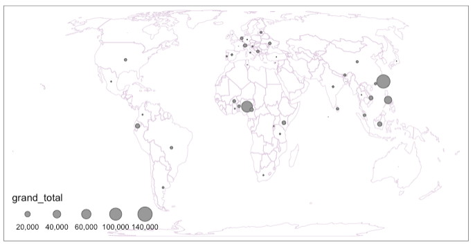

```{r setup, include=FALSE}
knitr::opts_chunk$set(echo = FALSE)
library(knitr)
```

I made a basic map of total plastic pollution by country using:
1) dplyr join function to merge lat/long coords from downloaded data; and 
2) tmap package to map countries' plastic data onto a world map. 

I used this helpful bit of code `data.frame[row_number, column_number] = new_value` to rename some countries in the plastics data so they would match my downloaded dataset.

```{r, fig.cap="Total plastic pollution by country (add units)"}

```

