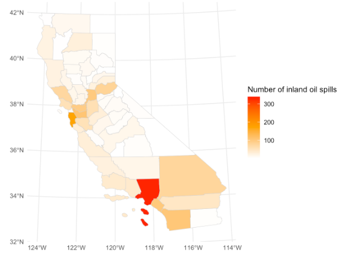

```{r setup, include=FALSE}
knitr::opts_chunk$set(echo = FALSE)
library(knitr)
```

Here I created a static map in ggplot illustrating inland oil spill events by county. After joining spatial data for CA counties with a dataset for oil spills in the state, I used geom_sf() to create a chloropleth map in which the fill color depended on the count of inland oil spill events by county.

```{r, fig.cap="Total inland oil spills by county in 2008"}

```
